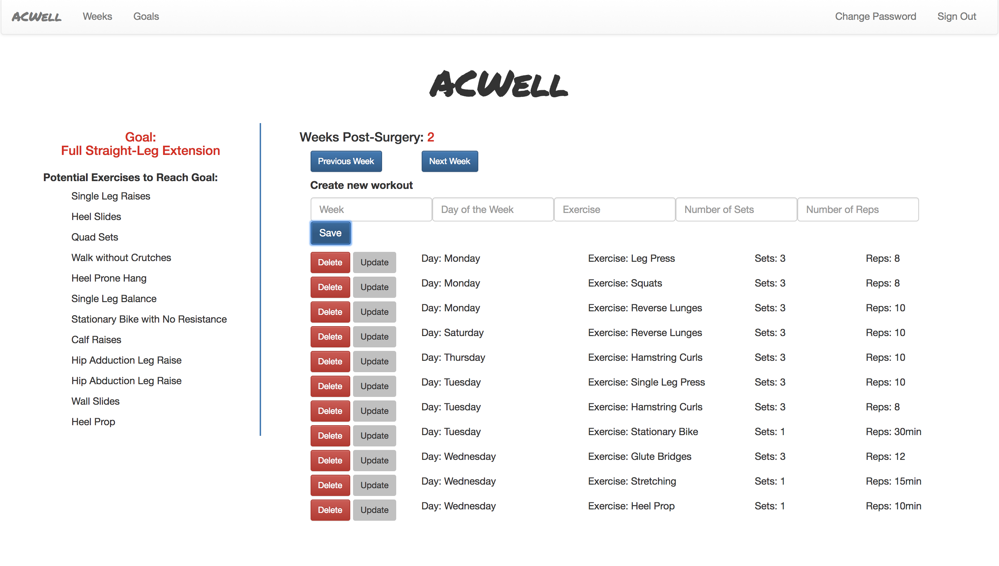

# ACWell App!

ACWell is an app designed for users recovering from ACL repair surgery. In going
through the recovery process, it is often very difficult to keep track of progress
and to still remember what you should be focusing on to speed the recovery along.
ACWell hopes to make this process easier by allowing users to track their
progress as they recover while also giving them weekly goals and suggested
exercises to help them reach their goals.

Upon logging in, users can begin to track their workouts and get weekly goals
and suggested exercises by selecting 'weeks' from the navigation bar at the top
and then entering the number of weeks post-surgery that they are. Once they
do that, they will be able to create, update, and delete workouts as they
progress.

## Screenshot of the App

## Link to Frontend Repo: https://github.com/dannyclark77/acl-client
## Link to Frontend Deployed Site: https://dannyclark77.github.io/acl-client/
## Link to Backend-API Repo: https://github.com/dannyclark77/acl-back-end
## Link to Backend-API Deployed Site: https://gruesome-eyeballs-71988.herokuapp.com/

## Planning

The idea of an ACL recovery workout tracker came out of my own personal experience
having had ACL repair surgery. Through the rehab process, I found it really difficult
to keep track of what I should be aiming for each week of the recovery process,
and to keep track of what workouts I had done on which day. The volume of rehab,
particularly in the first few weeks, can be overwhelming, and having some way to
track progress would have been immensely helpful.

After developing the idea, I wrote up several user stories to guide the rest of
my process. Once I had those down, I spent a fair bit of time drawing up different wireframes
to determine the best way to navigate the page with the various pieces of information
that I wanted to include. Following this, I set up my ERD, which was revised a
couple times through the building of the app as I went through different iterations
of whether the goals and recommended exercises would be linked to workouts in
any way, or linked to each other in any way. I ultimately decided that it would
be best if goals were its own resource, exercises were its own resource, and
workouts would be connected to users in a many (workouts) to one (users) relationship.

## User Stories, Wireframe, & ERD

## Link to Wireframe: https://imgur.com/genR81o
## Link to ERD: https://imgur.com/TIeOEFo

- As a person with a torn ACL, I want to know what exercises I should be doing
each week after surgery
- As a person with a torn ACL, I want to be able to track what exercises I am
doing each day
- As a physical therapist, I want to be able to see what exercises my patients
are doing
- As a person with a torn ACL, I want to be able to see all potential exercises
for a given week that I could do
- As a person with a torn ACL, I want to be able to add new exercises to the
exercise list for each workout
- As a website user, I want to be able to delete an exercise from my list if I
mistakenly add it.

## Dependencies

Install with 'npm install', 'bower install', and 'bundle install'

## Technologies Used

- Ember
- Javascript
- HTML
- CSS
- Bootstrap
- Ruby
- Rails

## Resources Used

- Class Notes
- Stack Overflow
- Previous Projects
- General Assembly Consultants

## Future Plans

There are three things I would like to do in the future to increase the usability
of the site:
1. Allow users to edit the goals and suggested exercises for each given week.
  This would make for a more customized experience for the user.
2. With permission, allow a user to see another user's workouts. I think this could
  be beneficial for a physical therapist to be able to see a patient's progress.
3. Improve the 'create' function to make it more efficient. I think this would include
  auto-filling the week based on the current week selected, and potentially adding
  a click-button for each day of the week that would initiate the 'create' process
  by auto-filling that day of the week also.
